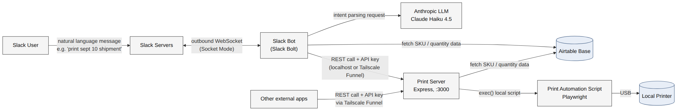

# Print Flow System

A Slack-driven system for printing FBA/warehouse shipment labels on demand. A user asks for something in Slack using plain language, a bot figures out what they mean, and a print server on a local machine runs the actual print job.

The system is made up of three GitHub repositories:

| Repo | Role |
|---|---|
| [`warehouse-slack-bot`](https://github.com/swurlybox/warehouse-slack-bot) | The Slack Bot — receives user requests, parses intent, calls the Print Server |
| [`rpi-job-scheduler`](https://github.com/swurlybox/rpi-job-scheduler) | The Print Server — Express API that triggers the print automation script |
| [`Seller-Central-Label-Printing-Automation`](https://github.com/DarienDuong/Seller-Central-Label-Printing-Automation) | The Print Automation Script — Playwright automation that prints labels for given SKUs |

---

## Architecture



**Cost note:** the only recurring cost in this system is the LLM intent parser (Anthropic API usage). The Slack Bot and Print Server can be hosted on any dedicated cloud provider, but we currently use Tailscale as a free option for networking between them.

### Slack Bot

The purpose of the Slack Bot is to receive the user's message from Slack, match the user's intent to a known tool or function, and offload that work to the Print Server.

- Built with the **Slack Bolt Framework**. The application is configured on the [Slack API: Applications](https://api.slack.com/apps) site and installed into our Slack organization as a bot. A fair bit of manual configuration is required for this part — see [Setup / Configuration](#setup--configuration).
- An **outbound WebSocket connection** is established from the Slack Bot to the Slack servers, allowing the bot to receive requests from Slack users. Because the bot initiates this handshake, it doesn't need to expose any IP addresses or ports — this isolates the bot from the public internet and ensures it only accepts communication from Slack users in the installed organization.
- The Slack Bot communicates with a cloud LLM hosted by Anthropic for intent parsing. We opted for **LLM-based intent parsing over rule-based parsing**: rule-based parsing requires users to phrase requests in a strict format, whereas an LLM can determine intent from a natural-language request given a list of supported tools/functions. Since intent parsing isn't a complex task, we use the cheapest/most efficient model available — currently **Claude Haiku 4.5**.
- If no intent is matched, an error response is sent back to the user. If a valid intent is found, the Slack Bot hits the corresponding endpoint on the Print Server. It may first need to fetch data from Airtable (such as SKU number and label quantity) and format that into the request body — the Print Server's print routes expect SKUs and label quantities as input, matching what the Print Automation Script itself expects.

### Print Server

A typical Express server exposing endpoints that execute specific tasks. One such endpoint is `POST /print`, which invokes a local CLI script that handles print automation via an `exec()`-like command. The print endpoint doesn't strictly have to invoke an external program — it's just set up that way because the Print Automation Script was built first, and the Print Server was layered on top of it afterward.

- Runs on `localhost:3000`.
- Exposed to external applications via **Tailscale Funnel**, which generates a semi-permanent public URL; traffic hitting that URL is funneled into the local port. Tailscale also provides a web dashboard ("Tailscale console") for configuring networking settings, such as an IP allowlist.
- All routes should be protected behind an API key so not just anyone on the internet can hit the Print Server and execute tasks.
- **Known gap:** DoS protection has not been addressed yet as of this iteration — worth revisiting soon.

### Print Automation Script

Uses **Playwright**, a JS library, to perform browser automation and run our internal printing workflow for a given SKU.

- Input comes in through a local JSON file or command-line arguments, always in the form of a SKU paired with a quantity of labels to print.
- A local printer needs to be connected to the machine running this script. We've been doing this over a wired **USB** connection and have not confirmed whether it works wirelessly.

---

## User Workflow

Typical workflow:

1. **The user messages the Slack Bot** (which appears like a regular user in the Slack organization) with a natural-language request, e.g. *"what's the status of Next Shipment"* or *"print remaining labels of Sept 10 shipment"*. Supported commands can be listed at any time by messaging `help`.
2. **The Slack Bot determines intent.** The message is sent to a cloud LLM hosted by Anthropic, which returns the matched intent to the bot. If no supported function is found, an error message is returned to the user, letting them know their request wasn't understood.
3. **A valid intent triggers the corresponding endpoint on the Print Server**, via a REST API (HTTP) call. (The Print Server can also be reached by other external applications through Tailscale Funnel, authenticated via an API key.) The Print Server then executes the relevant local script — the Print Automation Script must live on the same machine as the Print Server.
4. **Once the local script finishes, a response is returned** through the original pipeline back to the user or external application.

### Supported commands

*(also retrievable at any time via the `help` command)*

- `print remaining labels for the [shipment name] shipment`
- `test print remaining labels for the [shipment name] shipment`
- `print sku(s) [SKU, SKU, ...] from the [shipment name] shipment`
- `test print sku(s) [SKU, SKU, ...] from the [shipment name] shipment`
- `check status of the [shipment name] shipment`
- `check status of all shipments`
- `help`

---

## Setup / Configuration

Deploying this system on new infrastructure is one of the more tedious parts — setting up `.env`s and manual configuration on external sites is required for parts of the system to communicate with one another. We'll start with getting the code pulled in. Ideally, each repository should have its own `README.md` with setup instructions; this section is a higher-level walkthrough tying all three together.

### 1. Slack Bot

Fork [`warehouse-slack-bot`](https://github.com/swurlybox/warehouse-slack-bot) and clone it into a folder of your choice, then:

```bash
npm install
cp .env.example .env
```

Fill in the following values:

**`AIRTABLE_API_KEY`, `AIRTABLE_BASE_ID`**
To create an Airtable API key: Airtable Builder Hub → Personal Access Tokens → Create Token. Under access, select your Airtable base. Under scopes, grant read access at a minimum, write access if you plan to allow the Slack Bot to write to the base.
The Base ID is found in the URL of your Airtable base — it looks like `appXXXXXXXXXX`.

**`ANTHROPIC_API_KEY`**
Using the LLM parser requires registering with Claude Console and loading at least $5 of usage credit. Register → create an API key → paste it in as the value.

**`SLACK_BOT_TOKEN`, `SLACK_APP_TOKEN`**
These require manual configuration on the [Slack API: Applications](https://api.slack.com/apps) site. Follow [this setup guide](https://docs.google.com/document/d/1ME0kG1KRpKsRrpm8bo403JWQnp3_ArPZlcf6ToqhC8c/edit?tab=t.0), skipping any steps that involve writing code — that part is already handled.

**`PRINT_SERVER_URL`**
If the Slack Bot lives on the same device as the Print Server, set this to `http://localhost:3000`. Otherwise, use the Tailscale Funnel URL for the Print Server.

**`PRINT_SERVER_API_KEY`**
Generate this together with the Print Server's key hash — see below.

**`AUTHORIZED_USER_IDS`**
A comma-separated list of Slack User IDs. This controls who in the Slack organization is allowed to communicate with the Slack Bot.

Once the `.env` is filled in and the bot is installed in your Slack org, start it with:

```bash
npm start
```

#### Generating the Print Server API key

Run once, on any machine with Node installed:

```bash
node -e "const c=require('crypto');const k=c.randomBytes(32).toString('hex');console.log('Raw key:',k);console.log('SHA-256 hash:',c.createHash('sha256').update(k).digest('hex'));"
```

This prints two values — a random 64-character hex key, and its SHA-256 hash. They're a pair: generate them together, and never regenerate one without the other. The whole point of storing only the hash server-side is that the raw key never touches disk on the server; hashing a different key won't match.

Where each value goes:

- **Raw key** → `warehouse-slack-bot/.env`, as `PRINT_SERVER_API_KEY=<raw key>`. This is what the Slack Bot sends as `Authorization: Bearer <raw key>` on every request to the Print Server.
- **SHA-256 hash** → `rpi-job-scheduler/.env`, as `JOB_SCHEDULER_API_KEY_HASH=<hash>`. This is what `middleware/api_auth.js` compares incoming requests against — the raw key is never stored on the print-server side, only its hash.

### 2. Print Server

Fork [`rpi-job-scheduler`](https://github.com/swurlybox/rpi-job-scheduler) and clone it, then:

```bash
npm install
cp .env.example .env
```

Fill in:

- **`JOB_SCHEDULER_API_KEY_HASH`** — the hashed key generated in the Slack Bot setup step above.
- **`PRINT_LABEL_WORKFLOW_ABSOLUTE_PATH`** — the absolute path to the directory holding the Print Automation Script.
- **`AIRTABLE_API_KEY`, `AIRTABLE_BASE_ID`** — same as the Slack Bot's, or create a new token if you'd prefer a separate one.

#### Exposing the Print Server via Tailscale Funnel

Only needed if the Slack Bot (or any other external application) lives on a different device than the Print Server. Skip this if everything runs on the same machine and `PRINT_SERVER_URL=http://localhost:3000`.

1. **Install Tailscale** on the device hosting the Print Server and sign in to your tailnet: [tailscale.com/download](https://tailscale.com/download).
2. **Confirm Funnel is enabled for the tailnet.** This is a one-time, org-wide setting in the [admin console](https://login.tailscale.com/admin/acls/file) (**Access controls** → "Add Funnel to policy") — if you've already turned this on for the tailnet, new devices don't need to repeat it.
3. **Start the Print Server** locally (`npm start` in `rpi-job-scheduler`, listening on port 3000).
4. **Turn on the funnel** for that port:
   ```bash
   tailscale funnel 3000
   ```
   The first time you run this on a given device, it'll prompt you to approve enabling Funnel for that device via a link — approve it there.
5. **Grab the public URL.** The command prints a URL in the form `https://<device-name>.<tailnet-name>.ts.net`, proxying HTTPS traffic back to `localhost:3000`. This is the value that goes in the Slack Bot's `PRINT_SERVER_URL`.
6. **Verify it's live** — open the funnel URL in a browser (or `curl` it) and confirm the Print Server responds. `tailscale funnel status` shows what's currently exposed on that device.

A few things worth knowing:
- The funnel stays active as long as Tailscale is running on that device and the process isn't stopped; run `tailscale funnel off` to disable it.
- Since the Print Server is already gated behind the `PRINT_SERVER_API_KEY`/`JOB_SCHEDULER_API_KEY_HASH` check, Funnel just handles getting traffic to the device — it doesn't replace that auth layer.

### 3. Print Automation Script

See the [`Seller-Central-Label-Printing-Automation`](https://github.com/DarienDuong/Seller-Central-Label-Printing-Automation) repo's own `README.md` for setup instructions.
